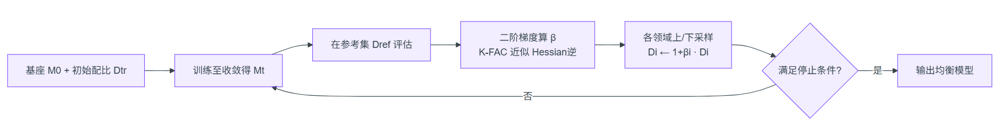

* 研究动机 \\
直接将多领域数据简单拼接，比单任务专精还差，会出现木桶效应；\\
已有的自动配比方法大多源于预训练场景，依赖一个小代理模型+全局权重搜索，忽略SFT阶段“数据-任务对齐直接引发跨领域干扰“的独特动态；\\
影响函数做数据选择，聚焦单个样本，按实例级打分，无法处理”调整整个数据集分布“；\\
* 研究目标 \\
在已有高质量多领域数据的前提下，找到一个最优的领域配比，让所有能力都能正常发育的最优分布。
* 核心idea \\
模型感知的梯度引导配比,引入一个领域级超参数 $\beta$ 控制每个领域数据相对原始量的重复/削减比例，把"找最优配比"写成以参考集损失为外层目标的双层优化，再用二阶信息一步算出 
的最优下降方向，迭代上/下采样逼近均衡。
* 算法流程 \\
给定基座模型 $M_0$ 和按领域切分的训练集 ${D_1,...,D_n}$ ，IDEAL 通过一个外部参考集 $D_{ref}$作为多任务性能的统一度量。每轮先在当前配比下把模型训到收敛，再用二阶梯度算出每个领域的调整系数 $\beta$ ，据此对各领域数据做上采样（ $\beta_i>0$ ，重复数据）或下采样（ $\beta_i<0$ ，削减数据），重构训练集后进入下一轮，通常 2 轮即可达到最优。

* 关键设计 \\
1、把配比写成双层优化，用链式法则求外层梯度：重复已有数据至多 4 次≈引入等量新数据"的发现启发，IDEAL 用 $\beta_i$ 控制领域 $i$ 重复数据的比例，重新定义最优参数为：

$$
\theta^* = \frac{1}{N + \sum_i \beta_i |D_i|} \arg\min_{\theta} \left( L(D_{\text{tr}}, \theta) + \sum_i \beta_i L(D_i, \theta) \right)
$$

外层目标是最小化参考集损失：

$$
Q(\beta) \coloneqq L(D_{\text{ref}}, \theta^*)
$$

对某个 $\beta_j$ 求导用链式法则拆成：$\frac{\partial Q}{\partial \beta_j} = \left( \frac{\partial L(D_{\text{ref}}, \theta^*)}{\partial \theta^*} \right)^\top \frac{\partial \theta^*}{\partial \beta_j}$ 。在初始状态 $\beta=(0,..,0)$ 处，利用隐函数定理可解得：

$$
\frac{\partial \theta^*}{\partial \beta_j} = -\left[ \nabla^2 L(D_{\text{tr}}, \theta^*) \right]^{-1} \nabla L(D_j, \theta^*)
$$

,于是配比方向最终由”参考集梯度xHessian逆x领域梯度“这个二阶量决定。\\
2、用 K-FAC 把 Hessian 逆算得动：对8B模型直接求逆是不可行的，借K-FAC理论把Hessian按MLP层近似成块对角，每层用 Kronecker 积分解 $H_l = \mathbb{E}\left(x_l x_l^\top\right) \otimes \mathbb{E}\left(\delta_l \delta_l^\top\right) = X_l \otimes \Lambda_l$ ，$x_l$ 是层输入、 $\deta_l$ 是反传误差，再对 $X_l, \Lambda_l$各做特征分解 $X_l = Q_{X_l} \Lambda_{X_l} Q_{X_l}^\top$ 来释放显存。这样 iHVP（逆 Hessian-向量积）的计算从全局矩阵求逆降为逐层的小矩阵运算，使二阶方法首次能在大模型 SFT 上落地。\\

3、按特征值方差挑"重要层"并用 γ 缩放补偿幅度：特征分解后的 $\Lambda$ 度量了伪梯度在各 K-FAC 特征向量上的方差，方差越低的 MLP 层越稳定，IDEAL 只保留这些"重要层"参与计算以进一步省显存。但只算部分层会让最终 $\beta$ 幅度偏小，于是引入动态缩放向量 $\gama$ 把 $\beta$ 中绝对值最大者线性放大到预设值m：

$$
\left. \frac{\partial Q(\beta)}{\partial \beta} \right|_{\beta=0},\quad \beta = -\gamma \odot \alpha,\quad \gamma = \frac{m}{\max|\alpha|}
$$

既保留各领域调整方向的相对关系，又把整体步长控制在可控范围. \\

4、上/下采样实现配比、随机采样降耦合：拿到 $\beta$ 后，按 $D_{i,t+1} \leftarrow (1 + \beta_i) D_{i,t}$ 对各领域做上采样（重复）或下采样（删减），用随机采样而非任何选择算法来增删数据。这个做法是为了把IDEAL增益与”样本选择质量“解耦，保证提升来自配比本身而非数据选择。

* 启发 \\
LESS（一阶梯度对齐目标分布）、SelectIT（用 LLM 内部不确定性选数据）等聚焦实例级，与 IDEAL 的领域级配比正交、可互补。
领域是人工预先切分的； $\beta$ 的最优性也依赖参考集 $D_{ref}$ 的代表性。
